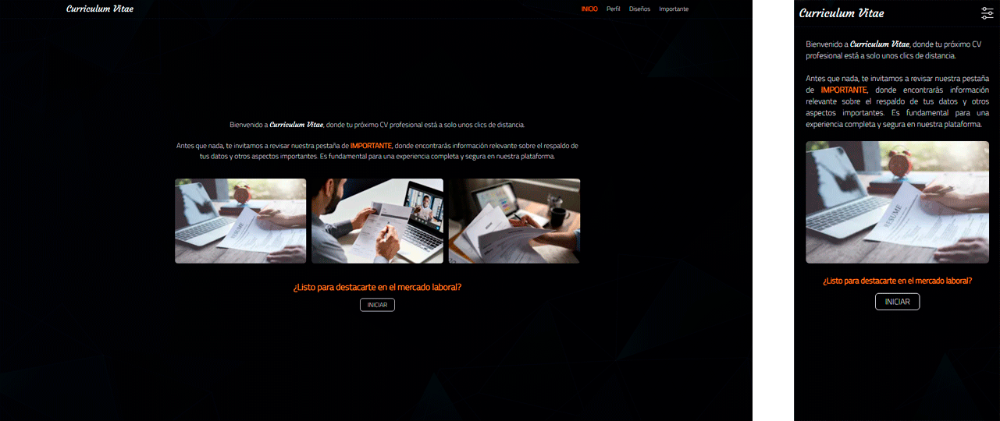
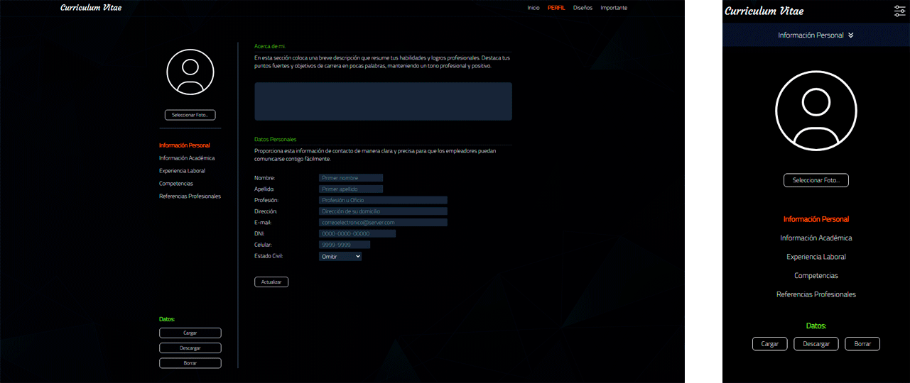
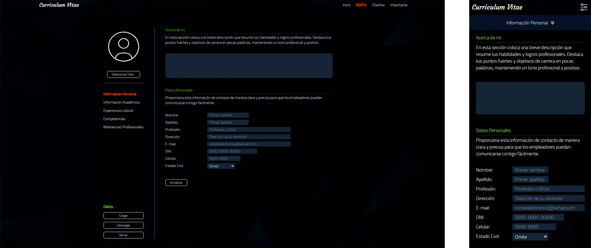
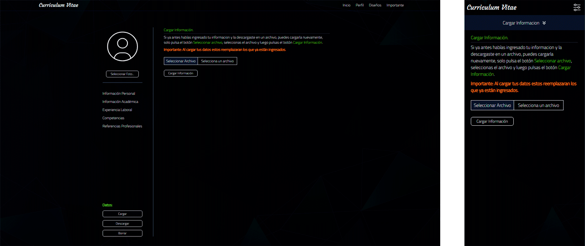
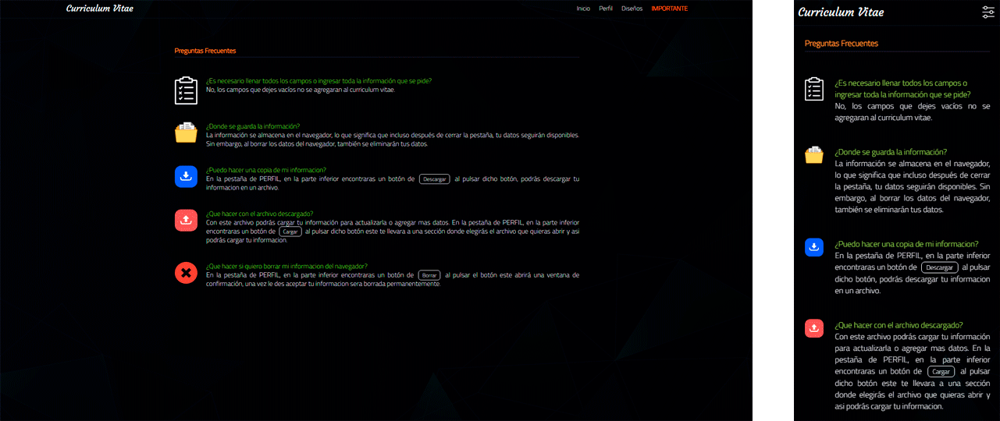

Este es un proyecto [Next.js](https://nextjs.org/)

## Tecnologías y Herramientas.

 

# Capturas de Pantalla.

 

## Comandos

- npm install - Instala las dependencias de Node
- npm run dev - Ejecuta el servidor de desarrollo.

Abre [http://localhost:3000](http://localhost:3000) con tu navegador para ver el resultado.

 

## Aprende mas

Para obtener más información sobre Next.js, consulte los siguientes recursos:

- [Documentación de Next.js](https://nextjs.org/docs) - Obtenga más información sobre las funciones y la API de Next.js.
- [Learn Next.js](https://nextjs.org/learn) - un tutorial interactivo de Next.js.

- Puede consultar [el repositorio de GitHub de Next.js](https://github.com/vercel/next.js/)

 

## Implementar en Vercel

La forma más sencilla de implementar su aplicación Next.js es utilizar la [Plataforma de Vercel](https://vercel.com/new?utm_medium=default-template&filter=next.js&utm_source=create-next-app&utm_campaign=create-next-app-readme) de los creadores de Next.js.

Consulte la [documentación de implementación de Next.js](https://nextjs.org/docs/deployment) para obtener más detalles..
